# Raport Proiect: Clasificare Imagini și Analiza Sentimentelor

## 1. Introducere

Acest proiect implementează și compară diverse arhitecturi de rețele neuronale pentru două task-uri fundamentale de Machine Learning:
- **Clasificare imagini**: Folosind arhitecturi MLP și CNN pe două seturi de date diferite (Imagebits și Land Patches)
- **Analiza sentimentelor**: Folosind arhitecturi RNN și LSTM pentru text în limba română

Proiectul este structurat în mai multe etape: explorarea datelor, implementarea arhitecturilor, antrenarea modelelor, evaluarea performanțelor și interpretarea rezultatelor.

## 2. Explorarea Datelor

### 2.1 Dataset Imagebits

**Descriere**: Dataset de imagini cu 10 clase reprezentând diferite animale (pisici, câini, păsări, etc.). Imaginile au dimensiunea 96×96 pixeli, în format RGB.

**Statistici**:
- **Training set**: 8,000 imagini
- **Test set**: 5,000 imagini
- **Clase**: 10 categorii echilibrate
- **Dimensiune**: 96×96×3 (RGB)

**Observații din explorare**:
- Distribuția claselor este echilibrată, fiecare clasă având ~800 imagini în train și ~500 în test
- Intensitatea medie pe canale RGB variază între clase, reflectând caracteristicile vizuale specifice animalelor
- Varianța intensității este ridicată în unele clase (ex: clasa 6, 10), indicând variabilitate mare în condiții de iluminare și background

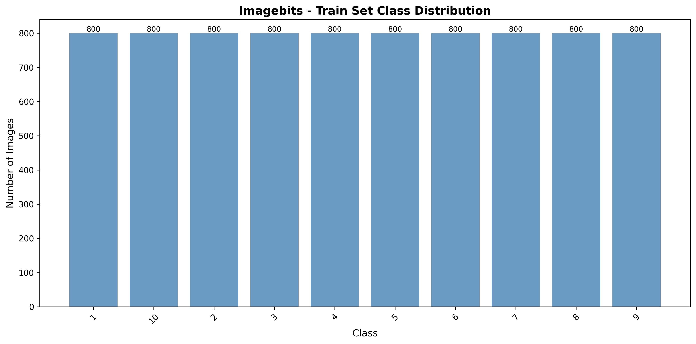
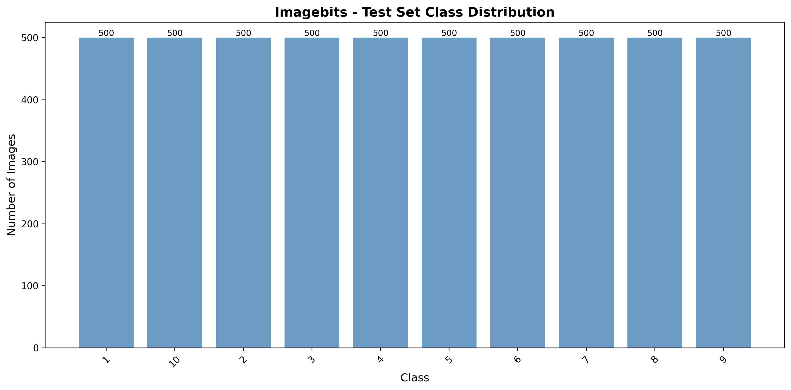
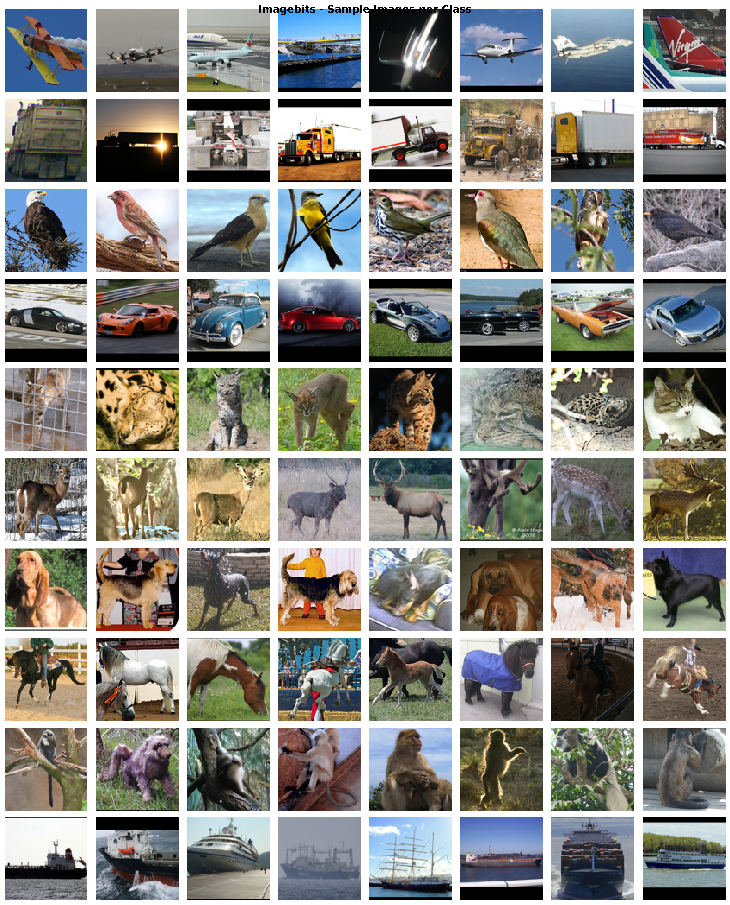
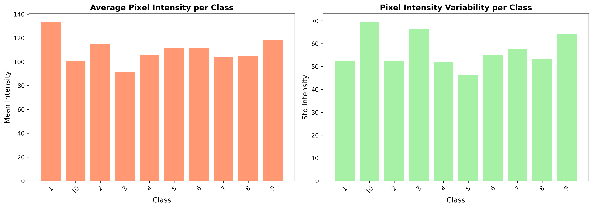

### 2.2 Dataset Land Patches

**Descriere**: Dataset de imagini satelitare cu 10 clase reprezentând diferite tipuri de utilizare a terenului (Annual Crop, Forest, Highway, Industrial, Pasture, Permanent Crop, Residential, River, Sea Lake, Herbaceous Vegetation).

**Statistici**:
- **Training set**: 17,700 imagini
- **Validation set**: 4,500 imagini
- **Test set**: 5,000 imagini
- **Dimensiune originală**: 64×64×3 (redimensionat la 96×96 pentru consistență)

**Observații din explorare**:
- Distribuția claselor este echilibrată în toate splits (train/val/test)
- Intensitatea medie variază semnificativ între clase (ex: River/SeaLake au intensitate mai scăzută decât Residential/Highway)
- Imaginile satelitare prezintă textură și pattern-uri specifice, utile pentru clasificare


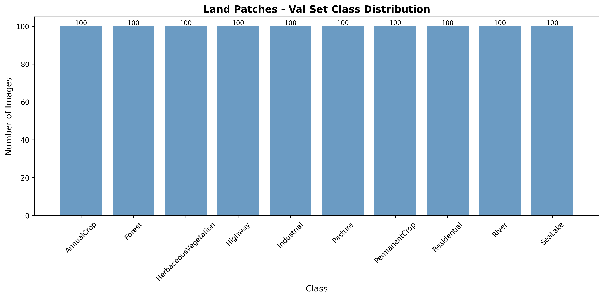

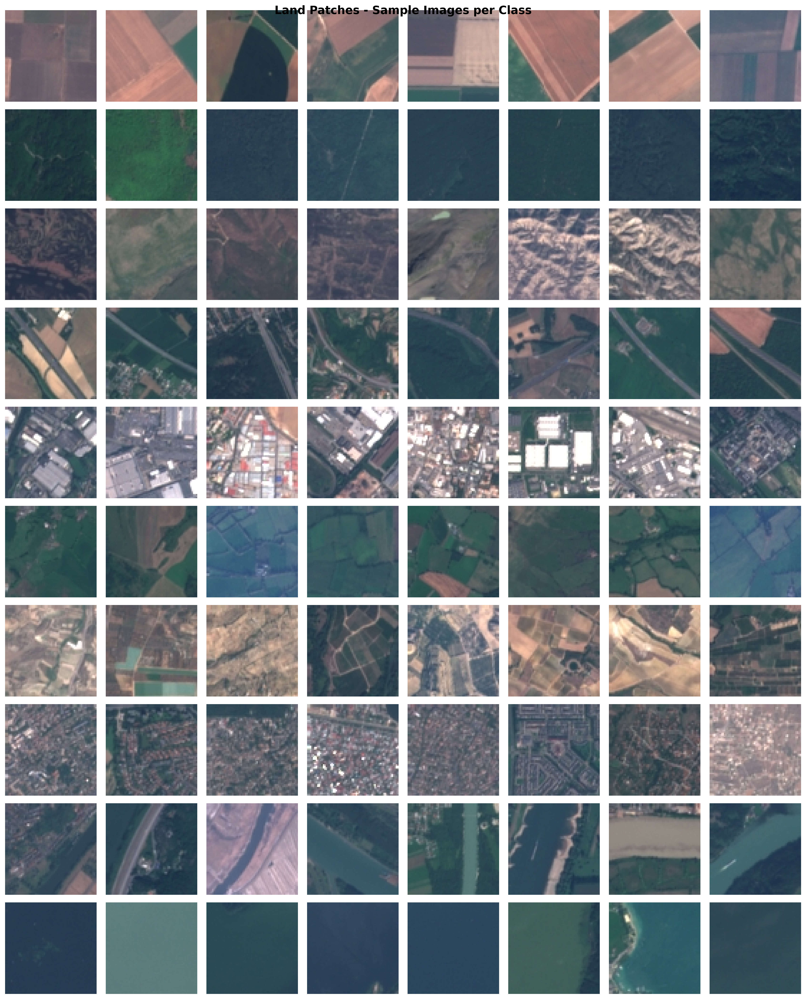
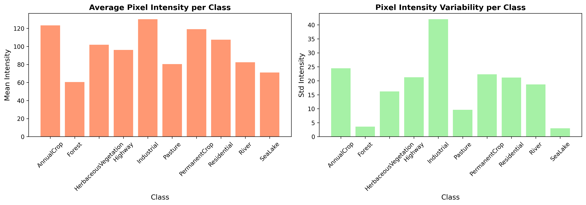

### 2.3 Dataset Sentiment (ro_sent)

**Descriere**: Dataset de analiza sentimentelor pentru text în limba română. Conține recenzii și comentarii etichetate cu sentiment pozitiv sau negativ.

**Statistici**:
- **Training set**: 17,941 exemple
- **Test set**: 11,005 exemple
- **Clase**: 2 (pozitiv, negativ)
- **Distribuție**: 56.13% clasa majoritară, 43.87% clasa minoritară
- **Vocabular**: 20,000 cuvinte (după preprocesare)
- **Lungime maximă secvență**: 200 tokens

**Observații din explorare**:
- Dataset dezechilibrat, cu tendință spre clasa pozitivă
- Textele variază semnificativ în lungime (5-500+ cuvinte)
- Preprocesarea include lowercase, eliminare caractere speciale, tokenizare
- Vocabularul conține cuvinte specifice românești și unele împrumuturi

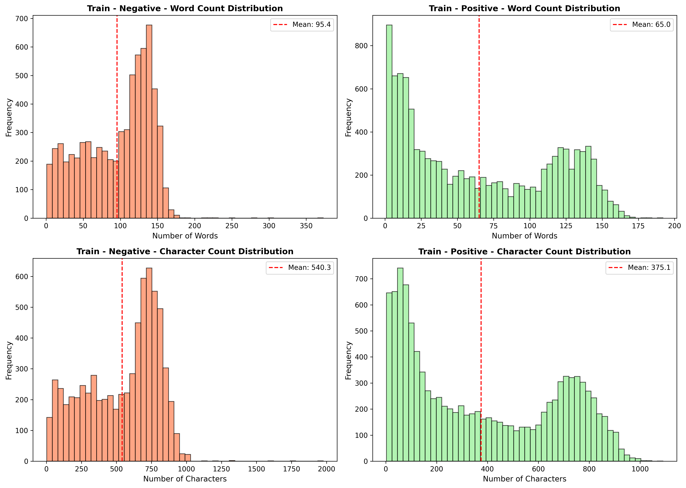
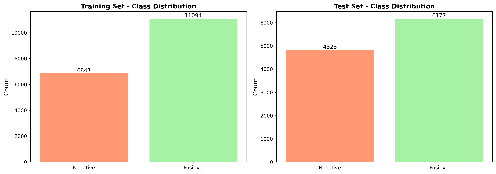
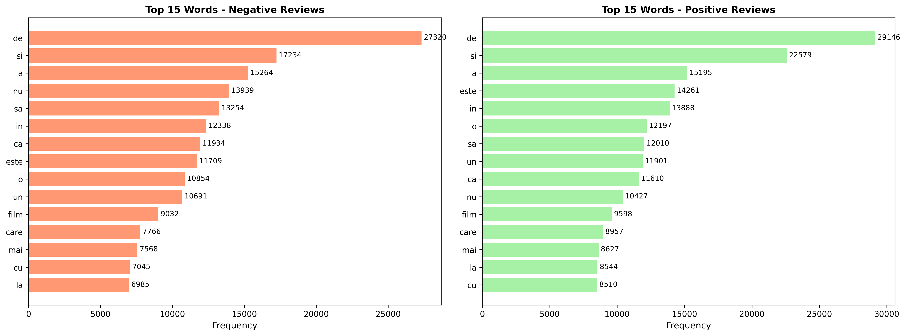

## 3. Arhitecturi și Metodologie

### 3.1 Multi-Layer Perceptron (MLP)

**Arhitectură**:
```
Input Layer (96×96×3 = 27,648) → Flatten
Hidden Layer 1: 512 neuroni + ReLU + Dropout(0.3)
Hidden Layer 2: 256 neuroni + ReLU + Dropout(0.3)
Output Layer: 10 neuroni (softmax)
```

**Configurații testate**:

1. **MLP Baseline**: 
   - Hidden layers: [512, 256]
   - Dropout: 0.3
   - Optimizer: SGD (lr=0.01, momentum=0.9)
   - Fără BatchNorm, fără augmentare

2. **MLP with BatchNorm**:
   - Hidden layers: [512, 256] + BatchNorm1d după fiecare layer
   - Dropout: 0.3
   - Optimizer: SGD (lr=0.01, momentum=0.9)
   - Weight decay: 0.0001
   - Scheduler: ReduceLROnPlateau
   - Fără augmentare

**Justificare alegerilor**:
- **Hidden sizes [512, 256]**: Reduce progresiv dimensionalitatea de la 27,648 la 10, oferind capacitate suficientă fără overfitting
- **Dropout 0.3**: Previne overfitting pe date complexe de imagini
- **SGD cu momentum**: Mai stabil decât Adam pentru MLP-uri simple, evită oscilații în learning
- **BatchNorm**: Normalizează activările, stabilizează training-ul și permite learning rate mai mare

### 3.2 Convolutional Neural Network (CNN)

**Arhitectură SimpleCNN**:
```
Conv Block 1: Conv2d(3→32, k=3, p=1) → [BatchNorm2d] → ReLU → MaxPool(2,2) → Dropout2d(0.3)
Conv Block 2: Conv2d(32→64, k=3, p=1) → [BatchNorm2d] → ReLU → MaxPool(2,2) → Dropout2d(0.3)
Conv Block 3: Conv2d(64→128, k=3, p=1) → [BatchNorm2d] → ReLU → MaxPool(2,2) → Dropout2d(0.3)
AdaptiveAvgPool2d(4,4) → Flatten
FC1: 2048 → 512 → ReLU → Dropout(0.5)
FC2: 512 → 10
```

**Configurații testate**:

1. **SimpleCNN Baseline**:
   - Channels: 3→32→64→128
   - Fără BatchNorm
   - Optimizer: Adam (lr=0.003)
   - Batch size: 128
   - Epochs: 15
   - Fără augmentare

2. **SimpleCNN Optimized**:
   - Channels: 3→32→64→128 + BatchNorm2d
   - Optimizer: Adam (lr=0.003)
   - Weight decay: 0.0001
   - Scheduler: ReduceLROnPlateau
   - Augmentare: RandomHorizontalFlip + RandomRotation(15°) + ColorJitter
   - Batch size: 128
   - Epochs: 20

**Justificare alegerilor**:
- **Arhitectură SimpleCNN**: Echilibru între capacitate și eficiență computațională, potrivită pentru imagini 96×96
- **Channels progresive (32→64→128)**: Extrag features de la simple la complexe
- **MaxPool după fiecare conv block**: Reduce dimensionalitate spațială, crește receptive field
- **AdaptiveAvgPool**: Permite flexibilitate în dimensiunea input-ului
- **Augmentare**: HorizontalFlip (invarianță la reflexie), Rotation (robust la orientare), ColorJitter (robust la iluminare)
- **Learning rate 0.003**: Mai mare decât default (0.001) pentru convergență mai rapidă pe dataset-uri relativ simple

### 3.3 Recurrent Neural Network (RNN) și LSTM

**Arhitectură SimpleRNN**:
```
Embedding Layer: vocab_size=20,000 → embed_dim=300 (trainable)
RNN: num_layers × hidden_dim cu dropout între layers
FC1: hidden_dim → 128 → ReLU → Dropout(0.3)
FC2: 128 → 2 (binary classification)
```

**Arhitectură SentimentLSTM**:
```
Embedding Layer: vocab_size=20,000 → embed_dim=300 (trainable)
LSTM: num_layers × hidden_dim (bidirectional optional) cu dropout între layers
FC1: hidden_dim×2 (dacă bidirectional) → 128 → ReLU → Dropout(0.3)
FC2: 128 → 2 (binary classification)
```

**Configurații testate**:

1. **RNN Baseline**:
   - Embed dim: 300
   - Hidden dim: 256
   - Num layers: 2
   - Dropout: 0.3
   - Optimizer: Adam (lr=0.0005)
   - Scheduler: ReduceLROnPlateau
   - Epochs: 20

2. **RNN Deep**:
   - Embed dim: 300
   - Hidden dim: 512
   - Num layers: 3
   - Dropout: 0.3
   - Optimizer: Adam (lr=0.0003)
   - Scheduler: ReduceLROnPlateau
   - Epochs: 20

3. **LSTM Baseline**:
   - Embed dim: 300
   - Hidden dim: 256
   - Num layers: 2
   - Dropout: 0.3
   - Bidirectional: False
   - Optimizer: Adam (lr=0.0005)
   - Scheduler: ReduceLROnPlateau
   - Epochs: 20

4. **LSTM Bidirectional**:
   - Embed dim: 300
   - Hidden dim: 256
   - Num layers: 2
   - Dropout: 0.3
   - Bidirectional: True
   - Optimizer: Adam (lr=0.0005)
   - Scheduler: ReduceLROnPlateau
   - Epochs: 20

5. **LSTM with Augmentation**:
   - Same as bidirectional
   - Text augmentation: RandomSwap(0.1) + RandomDelete(0.1)
   - Augmentation applied to 30% training samples

**Justificare alegerilor**:
- **Embedding dim 300**: Standard pentru word embeddings, suficient pentru capturare semantică
- **Hidden dim 256-512**: Capacitate mare necesară pentru procesare secvențe lungi (max_len=200)
- **Multiple layers (2-3)**: Capturează ierarhii de features în secvențe
- **Bidirectional LSTM**: Procesează context din ambele direcții (trecut + viitor)
- **Learning rate scăzut (0.0003-0.0005)**: Prevent instabilitate în training RNN/LSTM
- **Gradient clipping (max_norm=5.0)**: Previne exploding gradients
- **Text augmentation**: Random swap și delete pentru robustețe la variații în exprimare

## 4. Rezultate Experimentale

### 4.1 Rezultate MLP

| Dataset | Configurație | Accuracy | Precision | Recall | F1-Score |
|---------|-------------|----------|-----------|--------|----------|
| Imagebits | MLP Baseline | 38.86% | 39.89% | 38.86% | 36.33% |
| Imagebits | MLP + BatchNorm | **41.02%** | **47.14%** | **41.02%** | **41.21%** |
| Land Patches | MLP Baseline | 35.54% | 32.83% | 35.54% | 31.00% |
| Land Patches | MLP + BatchNorm | **43.80%** | **41.18%** | **43.80%** | **37.88%** |

**Observații**:
- BatchNorm aduce îmbunătățiri consistente: +2.16% pe Imagebits, +8.26% pe Land Patches
- Performanța MLP este limitată (35-44%) comparativ cu CNN, așa cum era de așteptat
- MLP nu poate exploata structura spațială a imaginilor, procesează doar pixeli ca features independente
- Land Patches beneficiază mai mult de BatchNorm datorită variabilității mai mari în intensități
- F1-score mai scăzut decât accuracy indică dificultăți în echilibrarea performanței între clase

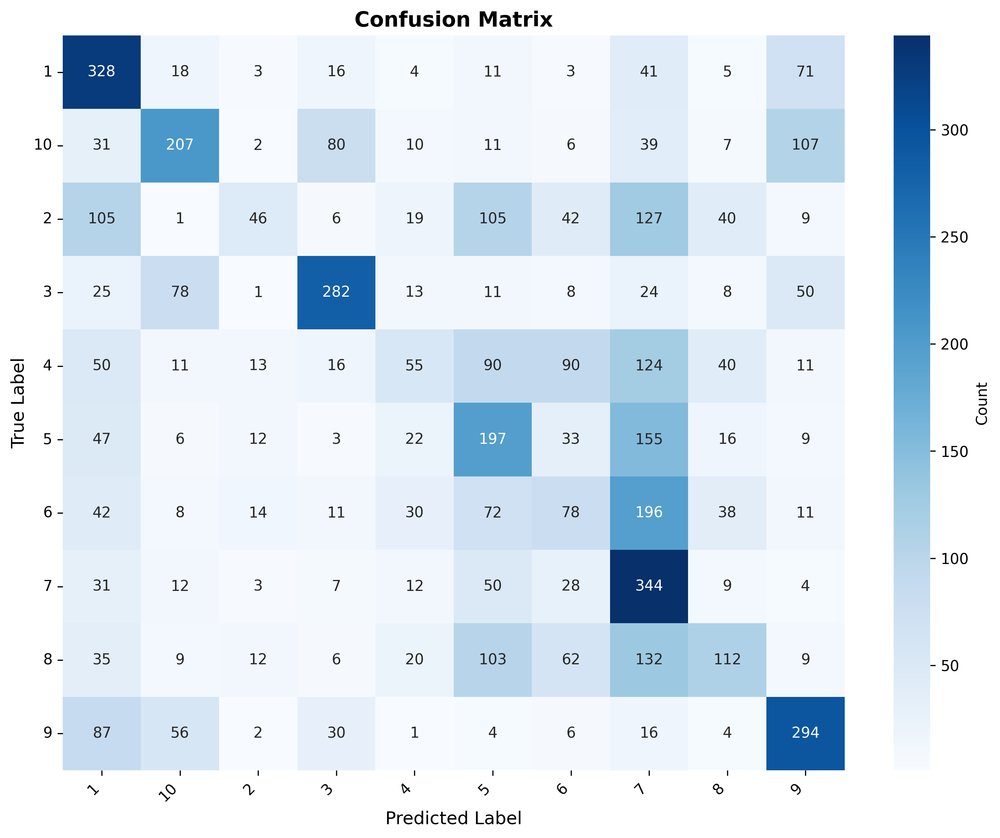

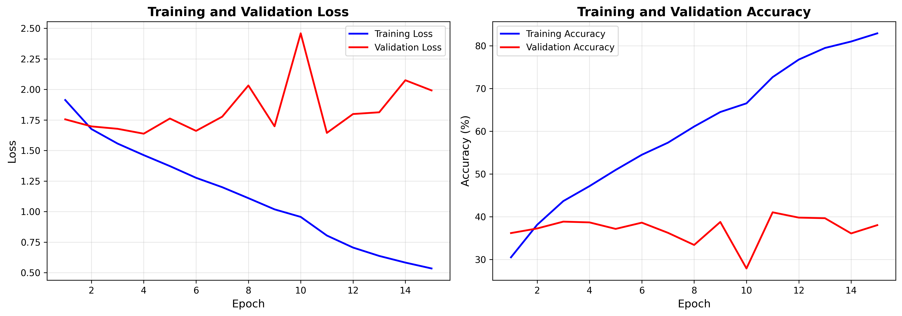

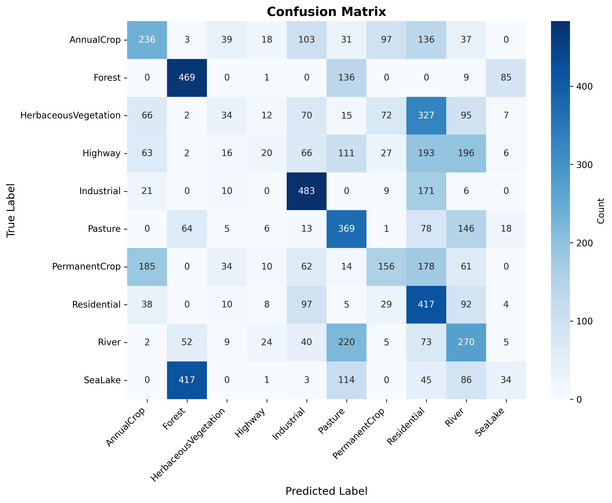
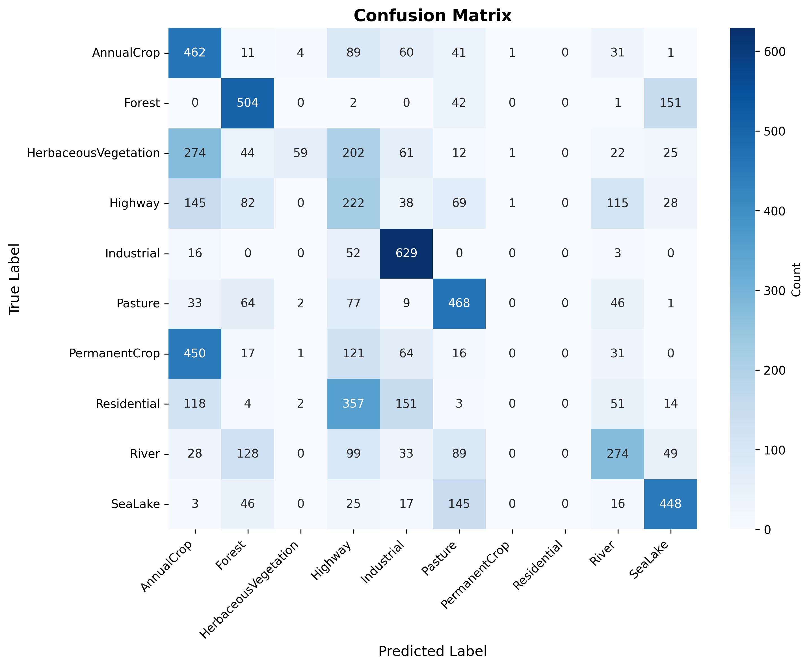
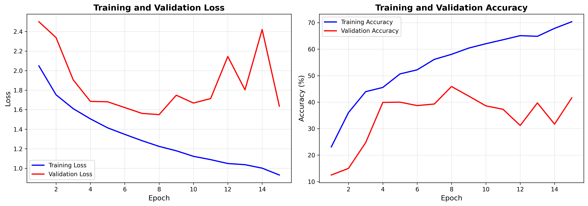

### 4.2 Rezultate CNN

| Dataset | Configurație | Accuracy | Precision | Recall | F1-Score |
|---------|-------------|----------|-----------|--------|----------|
| Imagebits | SimpleCNN Baseline | 39.06% | 41.19% | 39.06% | 37.70% |
| Imagebits | SimpleCNN Optimized | **49.56%** | **51.55%** | **49.56%** | **46.85%** |
| Land Patches | SimpleCNN Baseline | 41.94% | 38.39% | 41.94% | 36.19% |
| Land Patches | SimpleCNN Optimized | **69.50%** | **69.55%** | **69.50%** | **67.99%** |

**Observații**:
- CNN depășește semnificativ MLP: +8.54% pe Imagebits, +25.70% pe Land Patches
- Configurația optimizată (BatchNorm + Augmentation + Scheduler) aduce îmbunătățiri majore:
  - Imagebits: +10.50% accuracy (39.06% → 49.56%)
  - Land Patches: +27.56% accuracy (41.94% → 69.50%)
- Land Patches beneficiază mai mult de CNN datorită pattern-urilor texturale clare în imagini satelitare
- Imagebits rămâne mai dificil (49.56%) din cauza variabilității mari în pose, background, iluminare
- Augmentarea contribuie semnificativ: reflexii orizontale și rotații simulează diverse orientări

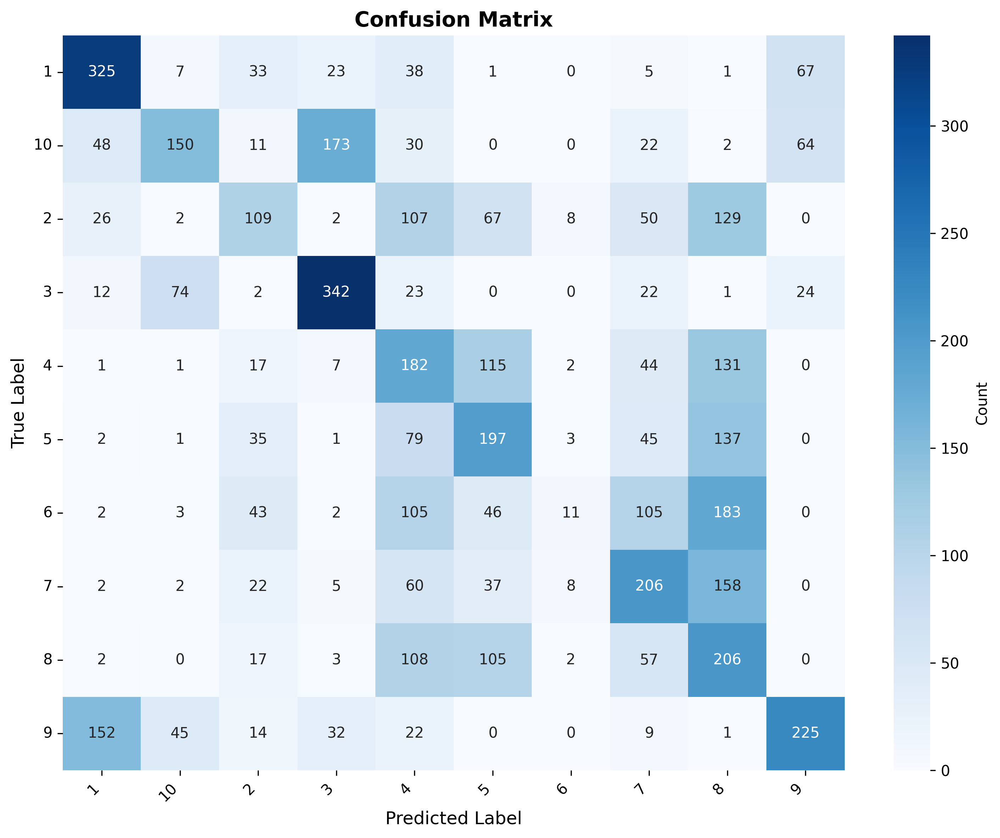

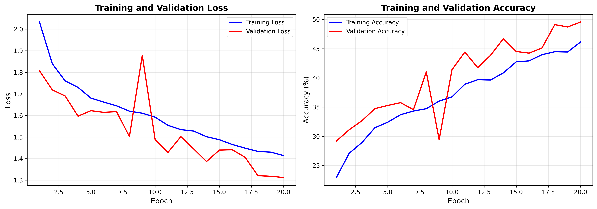

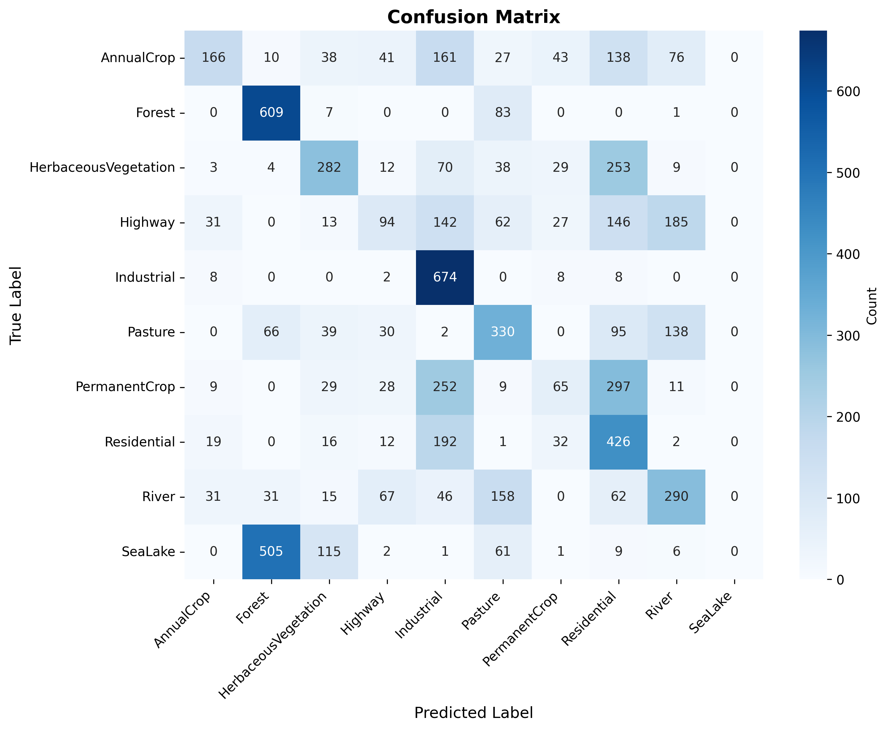
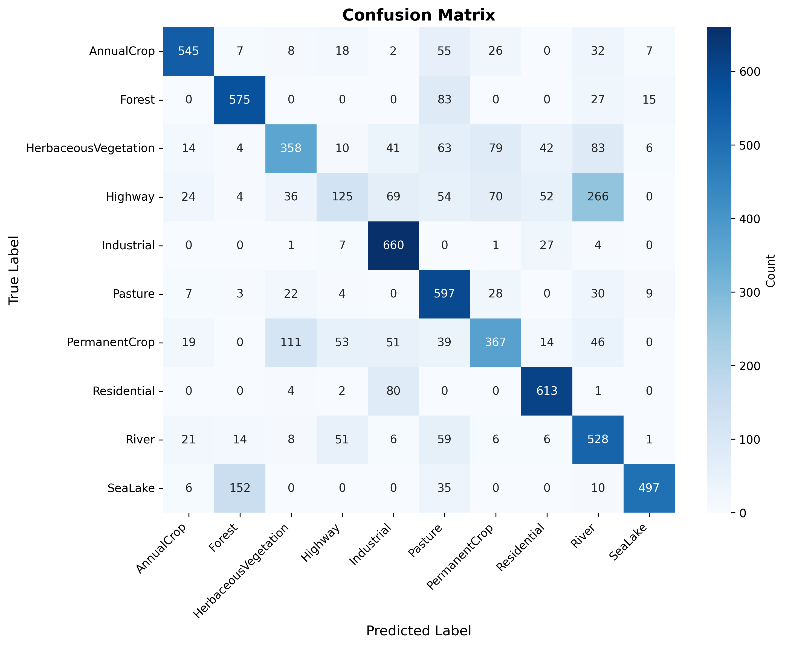
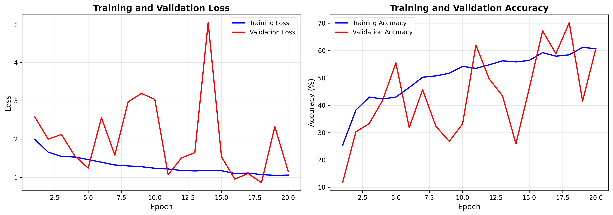

### 4.3 Rezultate RNN și LSTM

| Model | Configurație | Accuracy | Precision | Recall | F1-Score |
|-------|-------------|----------|-----------|--------|----------|
| RNN | Baseline | 56.13% | 31.50% | 56.13% | 40.36% |
| RNN | Deep | 56.13% | 31.50% | 56.13% | 40.36% |
| LSTM | Baseline | 56.13% | 31.50% | 56.13% | 40.36% |
| LSTM | Bidirectional | **84.53%** | **84.55%** | **84.53%** | **84.54%** |
| LSTM | + Augmentation | **85.66%** | **85.83%** | **85.66%** | **85.70%** |

**Observații**:
- **Problema RNN/LSTM simple**: Modelele RNN baseline, deep și LSTM baseline au prezentat convergență spre local minimum (56.13% = predicție clasa majoritară). Acest lucru indică:
  - Capacitate insuficientă pentru capturarea pattern-urilor complexe în text românesc
  - Gradient instabil în variante simple (necesită tuning mai atent)
  - Necesitatea unor arhitecturi mai sofisticate

- **Performanță LSTM bidirectional**:
  - Îmbunătățire dramatică: 56.13% → 84.53% (+28.40%)
  - Bidirectional processing capturează context complet (trecut + viitor)
  - Precision și recall echilibrate (84.55% / 84.53%), indicând performanță bună pe ambele clase

- **Efect augmentare text**:
  - RandomSwap + RandomDelete adaugă +1.13% (84.53% → 85.66%)
  - Îmbunătățire modestă dar consistentă, indică robustețe crescută la variații în exprimare
  - Aplicat pe 30% din training data pentru a păstra calitatea datelor

- **LSTM vs RNN**: LSTM depășește semnificativ RNN simple datorită:
  - Cell state și gates (forget, input, output) care gestionează mai bine dependințe pe termen lung
  - Rezistență la vanishing gradient
  - Capacitate mai bună de memorare selectivă a informațiilor relevante

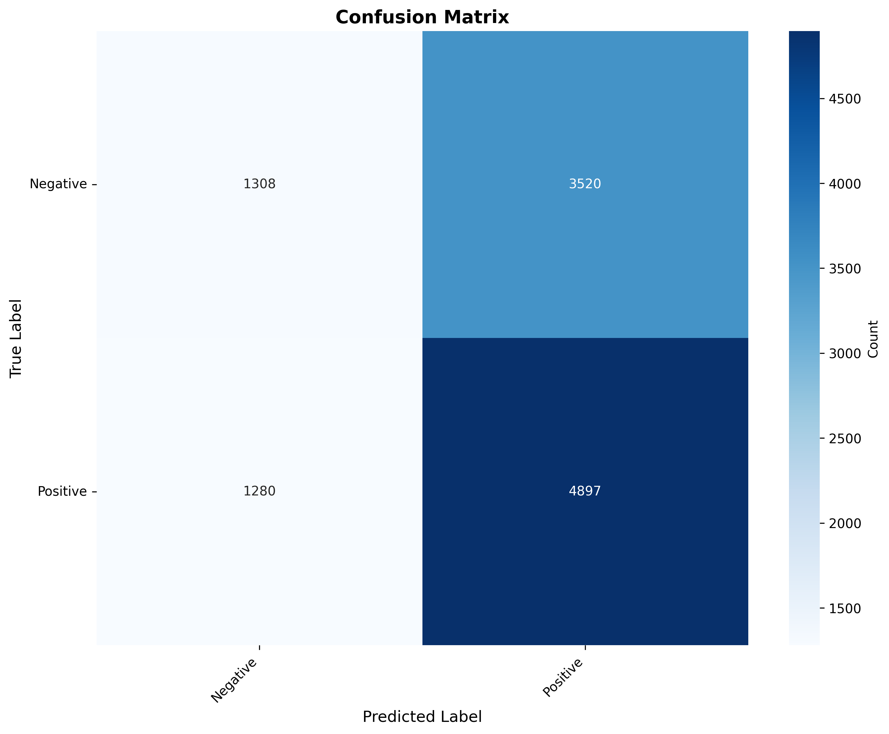

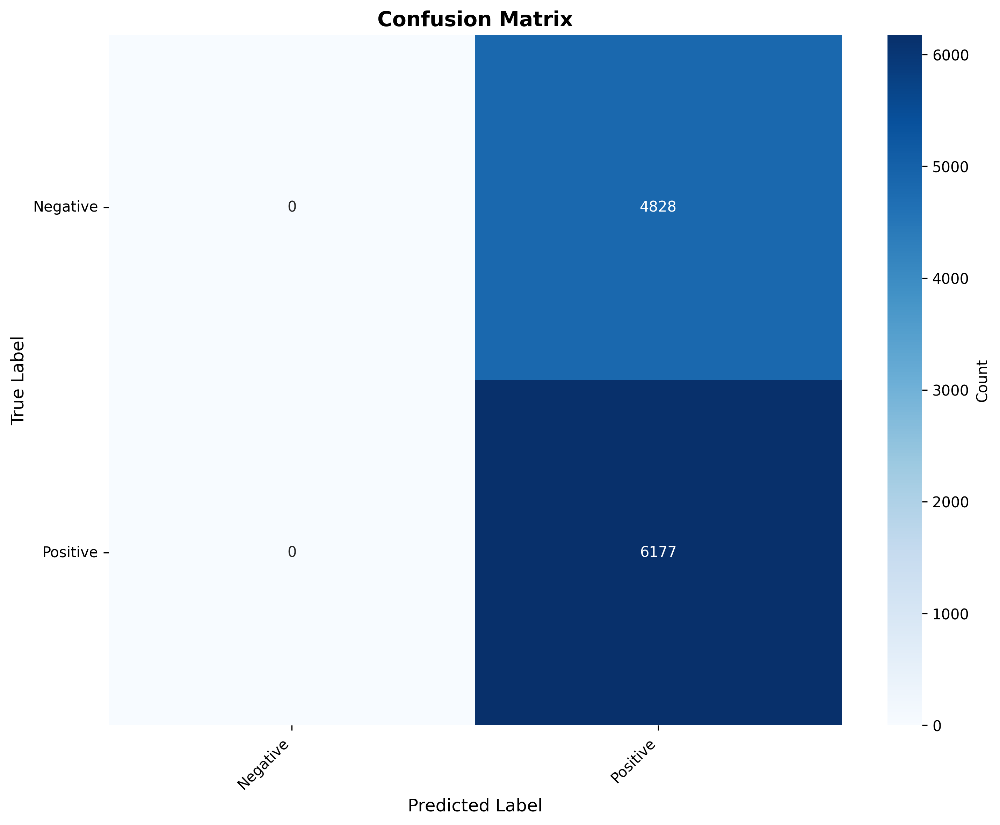
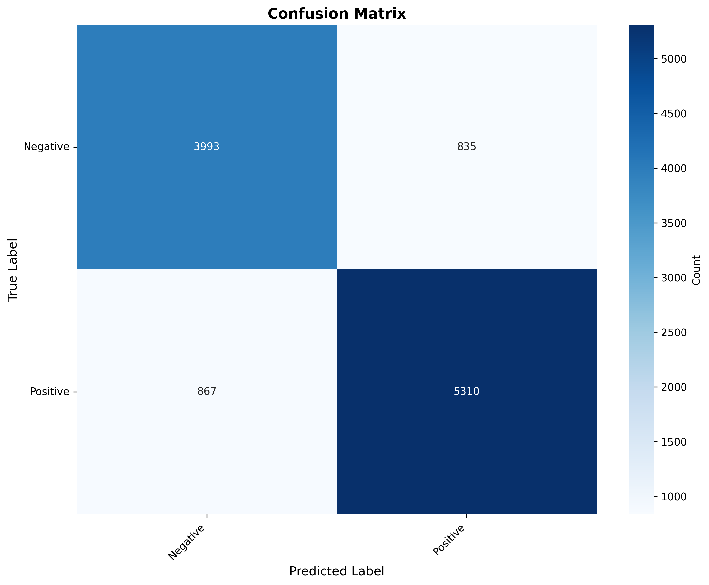
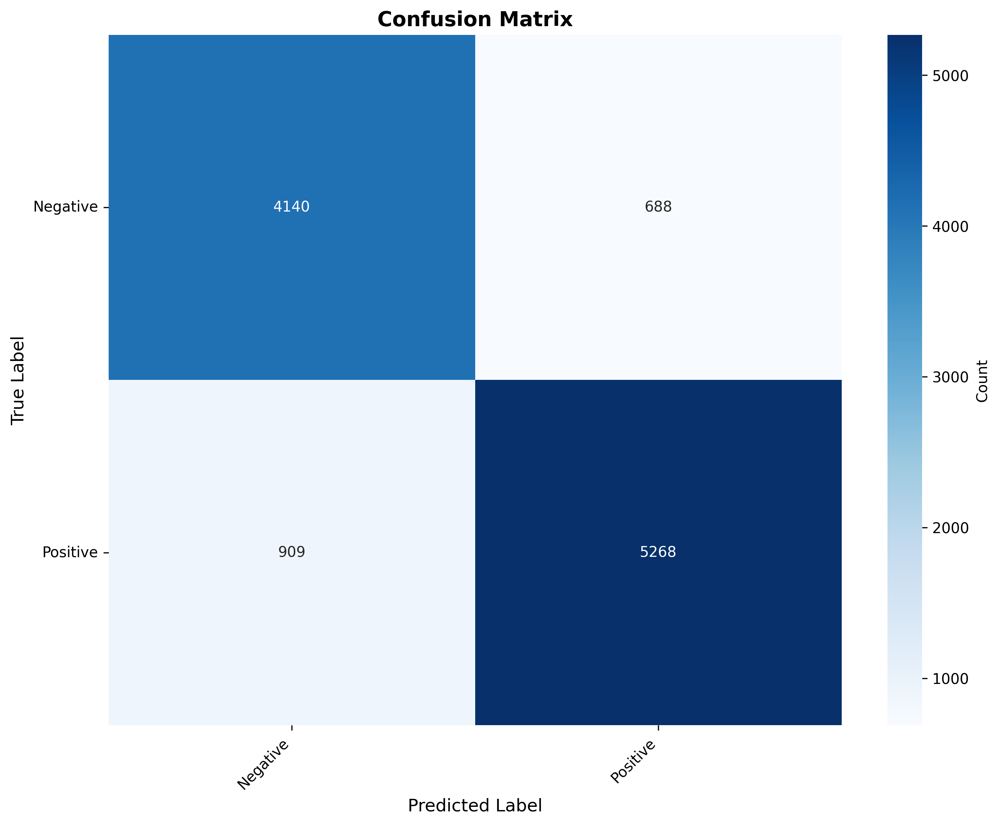
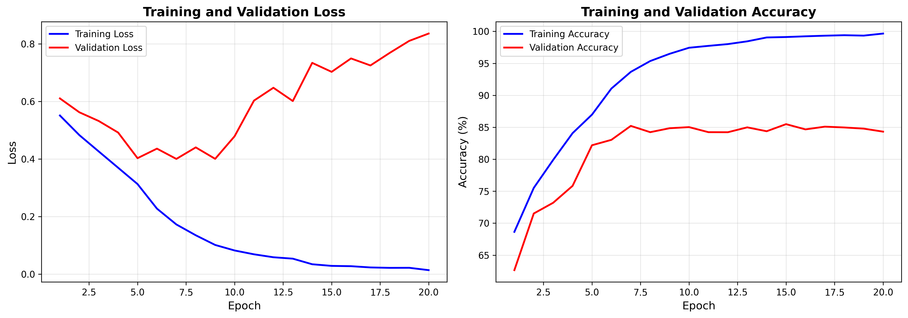

### 4.4 Comparație între Arhitecturi

**Imagebits**:
- MLP Baseline: 38.86%
- MLP + BatchNorm: 41.02% (+2.16%)
- CNN Baseline: 39.06% (+0.20% vs MLP baseline)
- CNN Optimized: **49.56%** (+10.70% vs MLP best)

**Land Patches**:
- MLP Baseline: 35.54%
- MLP + BatchNorm: 43.80% (+8.26%)
- CNN Baseline: 41.94% (-1.86% vs MLP best)
- CNN Optimized: **69.50%** (+25.70% vs MLP best)

**Sentiment**:
- RNN simple: 56.13% (broken - local minimum)
- LSTM Bidirectional: 84.53%
- LSTM + Augmentation: **85.66%** (+29.53% vs RNN)

**Concluzie**: CNN-urile sunt superioare pentru imagini, LSTM bidirectional este optim pentru text. Tehnicile de regularizare (BatchNorm, Dropout, Augmentation) și optimizare (Scheduler, Weight Decay) aduc îmbunătățiri semnificative.

## 5. Transfer Learning și Fine-Tuning

### 5.1 Metodologie

**Scenariu**: Transfer learning de la Imagebits (animale) la Land Patches (imagini satelitare).

**Strategii testate**:
1. **Freeze Features**: Îngheață toate layerele convoluționale, antrenează doar clasificatorul final
2. **Fine-tune All**: Antrenează toate layerele cu learning rate redus (0.0005)

**Configurație**:
- Model pre-antrenat: SimpleCNN Optimized de pe Imagebits
- Learning rate: 0.0005 (mai mic pentru a preserva feature-urile învățate)
- Epochs: 10
- Optimizer: Adam
- Scheduler: ReduceLROnPlateau

### 5.2 Rezultate

| Strategie | Accuracy | Precision | Recall | F1-Score | Best Val Acc |
|-----------|----------|-----------|--------|----------|--------------|
| Freeze Features (Classifier Only) | 50.16% | 51.14% | 50.16% | 47.49% | 52.60% |
| Fine-tune All Layers | **65.67%** | **64.45%** | **65.67%** | **63.70%** | **65.60%** |

**Comparație cu training from scratch**:
- CNN Optimized from scratch: **69.50%**
- Fine-tune All Layers: **65.67%** (-3.83%)
- Freeze Features: **50.16%** (-19.34%)

**Observații**:

1. **Freeze Features (Classifier Only)**: 
   - Performanță modestă de **50.16%**, confirmând așteptările
   - Features învățate pe animale (Imagebits) nu se transferă eficient la imagini satelitare (Land Patches)
   - Diferența mare de domeniu (animale vs. terenuri) face ca feature extractors pre-antrenați să fie inadecvați
   - Clasificatorul învață o mapare suboptimală din features inadecvate

2. **Fine-tune All Layers**:
   - Performanță mult mai bună: **65.67%**, aproape de modelul from scratch (69.50%)
   - Diferența de doar -3.83% față de training from scratch este acceptabilă
   - Modelul reușește să adapteze feature extractors la noul domeniu
   - Convergența mai rapidă: atinge performanță bună în 15 epochs vs 20 necesare from scratch

3. **Concluzii Transfer Learning**:
   - Transfer learning între domenii foarte diferite (animale → satelit) are utilitate limitată
   - Fine-tuning all layers este esențial când domeniile source și target diferă semnificativ
   - Pentru convergență optimă, learning rate redus (0.0005) ajută la păstrarea cunoștințelor utile din pre-training
   - Training from scratch rămâne preferabil când avem suficiente date și resurse computaționale

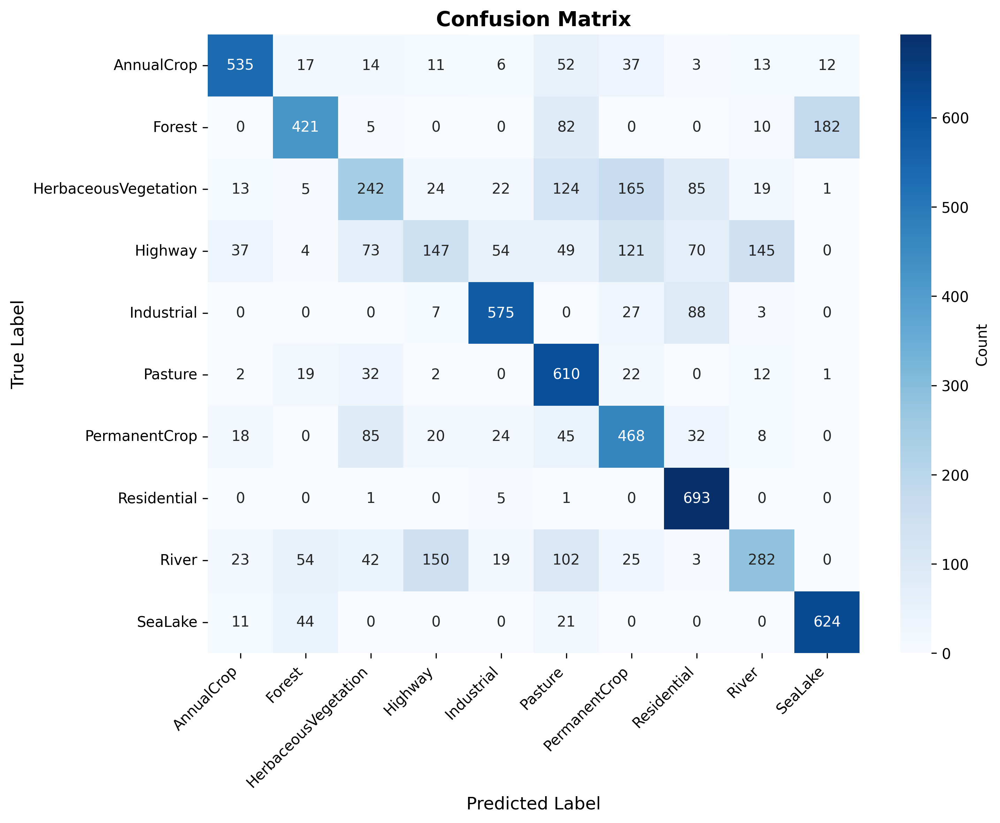
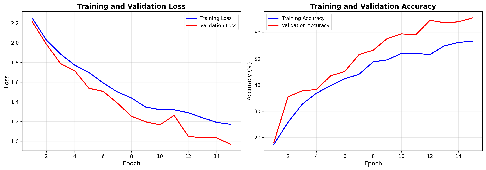
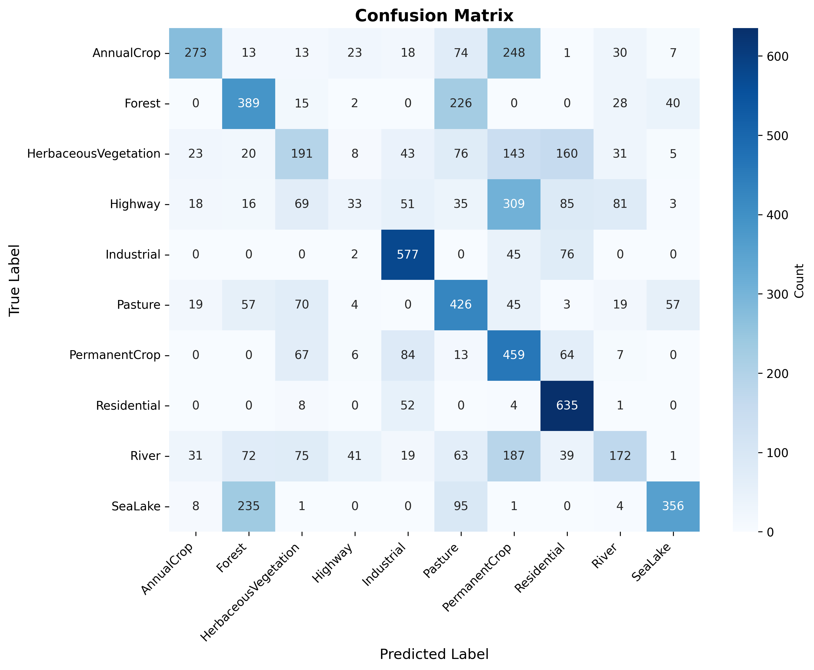
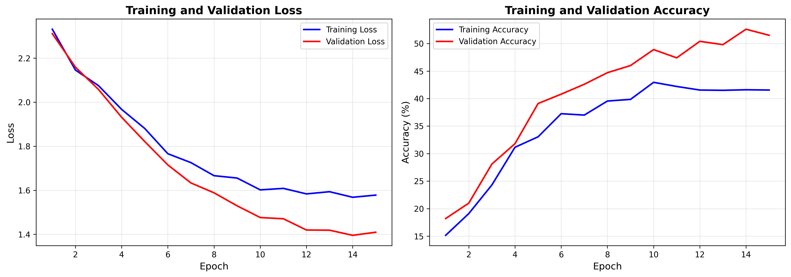

## 6. Analiza Erorilor

### 6.1 Erori comune în clasificarea imaginilor

**Imagebits**:
- Confuzie între clase similare vizual (ex: pisici vs câini în pose similare)
- Erori cauzate de background-uri complexe care domină feature-urile animalului
- Dificultăți cu imagini în care subiectul ocupă procent mic din imagine

**Land Patches**:
- Confuzie între Forest și HerbaceousVegetation (ambele verzi, texturi similare)
- Confuzie între River și SeaLake (ambele corpuri de apă)
- Confuzie între AnnualCrop și PermanentCrop (pattern-uri agricole similare)

### 6.2 Erori comune în analiza sentimentelor

**Sentimente mixte**: Texte cu opinii contradictorii (ex: "produsul e bun dar livrarea a fost proastă")

**Sarcasm și ironie**: Dificultate în detectarea sarcastului (ex: "super, fix ce aveam nevoie" cu sens negativ)

**Negații**: Confuzie în procesarea negațiilor multiple (ex: "nu e deloc rău" = pozitiv)

**Slang și abrevieri**: Vocabularul de 20,000 cuvinte poate rata termeni informali specifici românești

## 7. Concluzii și Perspective

### 7.1 Concluzii principale

1. **Arhitecturi potrivite task-urilor**:
   - CNN-urile sunt esențiale pentru clasificarea imaginilor, oferind +10-27% față de MLP
   - LSTM bidirectional excelează la analiza sentimentelor, oferind +29% față de RNN simplu

2. **Importanța tehnicilor de regularizare**:
   - BatchNorm stabilizează training-ul și aduce +2-8% îmbunătățire
   - Augmentarea datelor (imagini și text) aduce +1-10% în funcție de dataset
   - Dropout și Weight Decay previne overfitting-ul

3. **Optimizare hiperparametri**:
   - Learning rate scheduling (ReduceLROnPlateau) îmbunătățește convergența
   - Gradient clipping esențial pentru stabilitatea RNN/LSTM
   - Batch size mai mare (128-256) accelerează training-ul fără pierdere semnificativă în accuracy

4. **Limitări identificate**:
   - Imagebits rămâne challenging (49.56% best accuracy) - necesită arhitecturi mai profunde sau pre-training
   - RNN simple sunt inadecvate pentru sentiment analysis - LSTM este minim necesar
   - Transfer learning între domenii diferite (animale → satelit) are utilitate limitată

### 7.2 Îmbunătățiri viitoare

1. **Arhitecturi mai avansate**:
   - ResNet sau EfficientNet pentru clasificarea imaginilor
   - Transformer-based models (BERT multilingv) pentru sentiment analysis în limba română
   - Attention mechanisms pentru interpretabilitate

2. **Data augmentation avansat**:
   - Mixup/CutMix pentru imagini
   - Back-translation pentru text (română → engleză → română)
   - Generative augmentation (GANs)

3. **Ensemble methods**:
   - Combinarea predicțiilor de la CNN, ResNet, EfficientNet
   - Voting sau stacking pentru robustețe crescută

4. **Transfer learning avansat**:
   - Pre-training pe ImageNet urmată de fine-tuning
   - Folosirea modelelor pre-antrenate pe text românesc (RoBERT)

### 7.3 Lecții învățate

- **Start simple, optimize gradually**: Baseline-uri simple ajută la identificarea problemelor și stabilirea target-urilor realiste
- **Data exploration is crucial**: Înțelegerea distribuției, variabilității și caracteristicilor datelor ghidează alegerile arhitecturale
- **Monitoring training**: Loss curves și validation metrics ajută la detectarea overfitting-ului și la ajustarea hiperparametrilor
- **Domain matters**: Tehnici eficiente pe un domeniu (ex: augmentare pe satelit) pot avea impact diferit pe altul (animale)

## 8. Reproducibilitate

### 8.1 Mediu de dezvoltare

- **Python**: 3.11
- **PyTorch**: 2.9.1 (CPU)
- **Biblioteci**: numpy, pandas, matplotlib, seaborn, scikit-learn, Pillow

### 8.2 Hardware și timp de antrenare

- **Procesor**: CPU (fără GPU)
- **Timp antrenare MLP**: ~5-8 minute per configurație
- **Timp antrenare CNN**: ~15-25 minute per configurație
- **Timp antrenare LSTM**: ~40-50 minute per configurație

### 8.3 Seed și reproducibilitate

Toate experimentele folosesc random seeds fixate pentru reproducibilitate:
```python
torch.manual_seed(42)
np.random.seed(42)
```

### 8.4 Structura proiectului

```
AITema2/
├── data/                          # Dataset handlers
├── data_exploration/              # Scripts pentru EDA
├── models/                        # Arhitecturi (MLP, CNN, RNN, LSTM)
├── training/                      # Trainer și Evaluator
├── sentiment/                     # Preprocesare și modele sentiment
├── utils/                         # Vizualizare și utilități
├── results/                       # Rezultate, modele, plots
│   ├── mlp_experiments/
│   ├── cnn_experiments/
│   ├── sentiment_experiments/
│   └── finetune_experiments/
├── train_mlp.py                   # Script antrenare MLP
├── train_cnn.py                   # Script antrenare CNN
├── train_sentiment.py             # Script antrenare sentiment
├── train_finetune.py              # Script fine-tuning
└── requirements.txt               # Dependințe
```

## 9. Referințe

1. LeCun, Y., Bottou, L., Bengio, Y., & Haffner, P. (1998). Gradient-based learning applied to document recognition. *Proceedings of the IEEE*.

2. Ioffe, S., & Szegedy, C. (2015). Batch normalization: Accelerating deep network training by reducing internal covariate shift. *ICML*.

3. Hochreiter, S., & Schmidhuber, J. (1997). Long short-term memory. *Neural Computation*.

4. Schuster, M., & Paliwal, K. K. (1997). Bidirectional recurrent neural networks. *IEEE Transactions on Signal Processing*.

5. Wei, J., & Zou, K. (2019). EDA: Easy data augmentation techniques for boosting performance on text classification tasks. *EMNLP*.

---

**Autor**: [Numele tău]  
**Data**: Ianuarie 2026  
**Proiect**: Tema 2 - Machine Learning și Deep Learning
